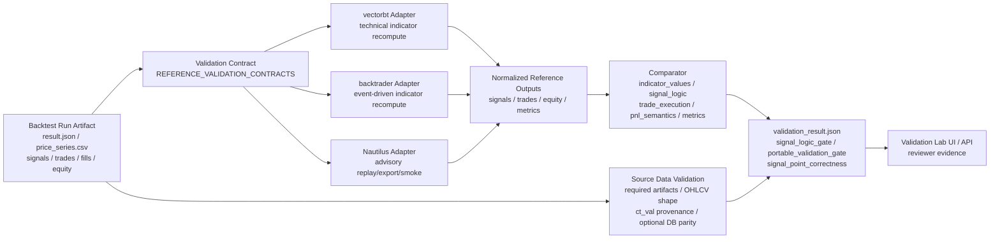

# Validation Lab 報告

本文件整理目前專案內 Validation Lab 的協作規範、驗證架構、外部回測引擎分工、參數判讀、限制，以及 2026-06-22 到 2026-06-23 針對 `BTC-USDT-SWAP` / Binance / `1H` 的 MA、EMA、MACD 驗證進度。

最重要的結論：Validation Lab 不是 live-ready 證明。它目前主要回答「同一批 artifact、同一組參數、同一套 entry/exit 規則下，外部 reference engine 是否能重算出一致的 signal timing / side / action」。任何策略進入 demo、shadow 或 live 前，仍必須依 `docs/ai_collaboration.md` 通過 source provenance、`ct_val`、idealized-fill 排除、differential validation、WF/CPCV、replay/shadow/demo 與使用者明確批准等 gate。

## 1. 協作架構與本報告範圍

本專案的協作方式是「Claude 做研究、審查與風險批判；Codex 做實作、測試、回測工作流與部署檢查」。本報告遵守以下界線：

- 只更新報告與簡報，不改策略假設、策略程式、風控、portfolio、execution、config 或既有 result artifact。
- 以 repo 內文件與 validation artifact 為準，不以聊天記憶為準。
- 所有 `strategy_fill`、`fill_all_signals`、`dual_output`、offline fixture 都標示為 research-only 或 advisory-only。
- 不把 `portable_validation_gate.passed == true` 解讀成 PnL、成交、成本、funding、WF/CPCV 或 live readiness 已通過。

本輪引用的主要證據：

| 類型 | 證據位置 | 可支持的說法 |
| --- | --- | --- |
| 2026-06-22 signal-to-order check | `results/validation_lab_signal_order_check_20260622.json` | realistic replay 下，MA/EMA/MACD signal 可以進入 order/fill 路徑；MA/EMA 大量 rejection 來自當時 fat-finger cap 與 reduce-only close 的互動 |
| 250/1.0 風控敏感度重跑 | `results/validation_lab_signal_order_check_20260622_maxord250_pospct1.json` 與 `..._verify2.json` | bounded reduce-only bypass 後，MA/EMA rejections 清零；成交偏少仍主要是 replay fill model 問題 |
| Dual Output MACD full-period | `results/validation_lab_macd_btc_binance_1h_20260622_dual_fullperiod_execution_comparison.json` | `strategy_fill` 與 realistic execution 的 fill conversion 差距極大 |
| Claude 2026-06-23 long-window engine consistency | `results/validation_lab_{ma,ema,macd}_crossover_btc_binance_1h_20260622_maxord250_pospct1_strategyfill/validation/claude_engine_consistency_20260623/validation_result.json` | vectorbt 與 backtrader 對 signal_logic PASS，actionable mismatch 為 0，portable validation gate 通過；仍是 advisory-only |
| Offline engine consistency fixture | `results/engine_consistency_fixture/fixture_manifest.json` | 已有短窗 frozen fixture，可作後續 `make engine-consistency-smoke` 的重複性檢查基礎 |
| Venue-scoped Binance DB parity PASS | `results/validation_lab_ma_crossover_btc_binance_1h_20260622_venue_scoped_pg_20260623/validation/codex_venue_scoped_pg_db_parity_20260623_pass/validation_result.json` | Codex 2026-06-23 structural fix forced venue-tagged candle reads through Binance-scoped canonical Postgres; MA DB parity PASS over 20,400 rows with `canonical_source_primary=binance` and 0 mismatches. |

## 2. Validation Lab 的目的

Validation Lab 的目的不是單純替代 TradingView，而是用低成本、可版本化、可審計的方式，把本專案保存的 backtest artifact 丟給外部 reference engine 做交叉驗證。

目前主要驗證目標是 signal-point correctness：

- 同一批價格資料。
- 同一組策略參數。
- 同一套 entry/exit 規則。
- 外部引擎是否在同一根 K、同一商品、同一方向產生同一個 action。

目前 strict gate 的核心是 technical strategies：

- `ma_crossover`
- `ema_crossover`
- `macd_crossover`

vectorbt 和 backtrader 對這三個 technical strategies 是 `reference_signals_only`，會從 `price_series.csv` 重新計算 MA/EMA/MACD 與 crossover。Nautilus 目前仍是 advisory replay/export/smoke，不是完整 matching engine parity，也不能單獨讓 portable validation gate 通過。

## 3. 驗證架構流程

低成本的意思是：不依賴付費閉源回測平台產生最終信任，而是把本專案已保存的 artifact 用開源或本地 reference path 重算、比對、留存 JSON/CSV 證據。這符合專案協作要求：不要靠聊天記憶或主觀判斷，要靠 repo 內可讀、可重跑的檔案。

## 4. 資料正確性目前如何驗證

目前已實作的資料驗證：

- `price_series.csv` 結構檢查：時間、OHLCV、商品欄位是否可讀。
- required artifacts 檢查：不同策略需要的價格、signals、funding、external observations 等檔案是否存在。
- `ct_val` provenance 檢查：SWAP 合約乘數來源是否 authoritative，例如 DB、明確 config override、spot unit，或 Binance/Bybit 一般 USDT-M perp 的 `exchange_base_unit`。
- optional DB parity：設定 `DIFF_VALIDATION_ENABLE_DB_PARITY=1` 並提供 DSN 時，會把 artifact close prices 與 canonical DB candles 做 timestamped close-only 比對。

目前尚未完整實作或尚未通過的資料驗證：

- 舊的 validation-lab Binance 1H runs 仍是 stale：它們是在 venue-scoped candle sourcing 修正前產生，不可當作 Binance DB parity PASS。
- Codex 2026-06-23 已補上結構修正並重生 MA/EMA/MACD `strategy_fill` runs；新的 MA run DB parity PASS：`canonical_source_primary=binance`、20,400 artifact rows、20,400 DB rows、0 mismatch。
- 2026-06-18 的 `codex_close_only_db_parity_pass_20260618` 曾記錄 192 bars 的 Binance DB parity PASS，但在目前 DB 狀態下不可直接視為 standing PASS，必須 re-seed/reverify 或標示 stale。
- 尚未做 Binance vs OKX vs Bybit 等跨交易所永續合約 K 線的相對性驗證。
- 尚未對高低價、成交量、funding、trade ticks、order book 做完整跨來源一致性驗證。

所以，「交易所 API 原始資料本身正確」不是目前已證明的結論。目前已能說的是：artifact 結構可讀、`ct_val` provenance 可檢查、且在有對應 canonical rows 與 DSN 時可做 artifact-to-DB close-only parity。

## 5. 外部回測引擎分工

| 項目 | 本專案 replay backtest | vectorbt | backtrader | Nautilus 目前 v1 |
| --- | --- | --- | --- | --- |
| 主要輸入 | `config`, `price_series.csv`, strategy params, risk config, instrument specs | `price_series.csv` close series, strategy params, `signals.csv` 比對 | OHLCV Pandas feed, strategy params, project-compatible indicator state | Artifact signals/prices 轉成 Nautilus-compatible replay/export/smoke |
| 商品與合約規格 | 需要 `ct_val`, `minSz`, `lotSz`, exchange/instrument specs | Signal gate 不需要完整合約規格；PnL advisory | Signal gate 不需要完整合約規格；market-order PnL advisory | 完整 parity 需要 Nautilus catalog/instrument mapping；目前未完成 |
| 風控與下單 | 會經過 sizing、`max_order_notional_usd`、position limit、kill/drawdown、execution model | 嚴格比 signal；`Portfolio.from_signals` equity advisory | 嚴格比 signal；broker/market-order advisory | Advisory order/fill replay/smoke；非專案策略原始碼 parity |
| 嚴格比較範圍 | 專案自身產生 orders/fills/equity | indicator/signal timing/side/action | indicator/signal timing/side/action | 目前不作 independent strict gate |
| Advisory 範圍 | 回測績效仍需 WF/CPCV 與 replay gates | trade/PnL/equity/metrics | trade/PnL/equity/metrics | execution/PnL/funding/queue/full matching |

相同點：

- 都使用同一個 artifact bundle 或由該 bundle 派生的資料。
- 都會把輸出標準化成 signals、trades、equity、metrics 供比較。
- MA/EMA/MACD 技術策略都以同一組 fast/slow/default MACD 參數重算 crossover。

不同點：

- 本專案 replay 會真的經過 portfolio sizing、risk guard、order manager、execution handler，因此可以看到 signal 是否變成 order、fill、rejection。
- 外部引擎 v1 主要是 reference signal recompute；它們不是目前專案風控/撮合模型的完整替身。
- Nautilus 是未來高保真 execution parity 的候選目標，但目前不是完整 Nautilus matching engine 驗證。

## 6. Validation result 主要欄位怎麼看

| 欄位 | 怎麼看 |
| --- | --- |
| `status` | 整體 validation run 狀態。PASS 不等於 live-ready，只代表該 artifact 的 validation scopes 沒有 hard failure。 |
| `admissibility` | 若為 `advisory_only`，表示不能單獨當 live/promotion 證據。 |
| `promotion_gate_evidence` | 是否可直接當 promotion gate 證據；目前 validation-lab 補驗證為 false。 |
| `source_data_validation.status` | 資料與 provenance gate。PASS 表示 artifact 結構、必要檔案與 `ct_val` 等檢查符合該 run scope。 |
| `source_data_validation.checks.db_parity.status` | DB parity 是否執行。SKIP 不代表 FAIL，但不能宣稱 DB parity PASS。 |
| `source_data_validation.checks.ct_val_provenance.status` | SWAP 合約乘數來源是否權威。這會影響 PnL / notional / risk 判讀。 |
| `signal_logic_gate.passed` | 技術策略最重要的 hard gate：至少一個 vectorbt/backtrader signal logic PASS 且 actionable mismatch 為 0。 |
| `portable_validation_gate.passed` | 該策略是否有合格 portable reference path。Advisory replay 不能讓它通過。 |
| `signal_point_correctness.passed` | 三引擎 point correctness matrix 的摘要；若該批沒有選 Nautilus，可能為 false，即使 vectorbt/backtrader strict signal logic PASS。 |
| `engines.<engine>.reference_role` | `reference_signals_only` 表示獨立重算 signal；`advisory` 表示只可作補充。 |
| `engines.<engine>.comparison.signal_logic.status` | signal timing/side/action 的嚴格比較結果。 |
| `actionable_mismatch_count` | 需要修正或審查的 mismatch 數。signal logic 中非 0 會阻擋。 |
| `mismatch_counts` / `mismatches_*.csv` | 可追到 indicator、signals、trades、PnL、metrics 的具體差異列。 |
| `validation_conclusion` | 對 gate 結論與 blocked reasons 的文字化摘要。 |

## 7. 2026-06-22 BTC/Binance 1H signal-to-order 實測

測試條件：

- Symbol: `BTC-USDT-SWAP`
- Exchange: Binance
- Bar: `1H`
- Local data: `data/ticks/BTC_USDT_SWAP/candles_1H.parquet`
- Window: 2024-01-01 to 2026-04-30
- Coverage: 20,400 expected / 20,400 actual bars, `coverage_pct = 1.0`
- MA: fast/slow = 10/200
- EMA: fast/slow = 10/200
- MACD: default 12/26/9
- Initial risk defaults: `max_order_notional_usd = 500`, `max_pos_pct_equity = 0.30`, `max_leverage = 3`
- Output summary: `results/validation_lab_signal_order_check_20260622.json`

初始 realistic replay 摘要：

| 策略 | 參數 | verdict | signals | submitted orders | real fills | rejected | 主要 rejection |
| --- | --- | --- | ---: | ---: | ---: | ---: | --- |
| `ma_crossover` | 10/200 SMA | PASS_SIGNAL_TO_ORDER | 117 | 5 | 31 | 112 | `fat_finger` |
| `ema_crossover` | 10/200 EMA | PASS_SIGNAL_TO_ORDER | 127 | 4 | 22 | 123 | `fat_finger` |
| `macd_crossover` | 12/26/9 | PASS_SIGNAL_TO_ORDER | 779 | 779 | 15 | 0 | none |

本次可確認：

- MA、EMA、MACD 都能在 signal 觸發時進入下單路徑，至少有 submitted order 與 real fill。
- `ct_val_sources.BTC-USDT-SWAP` 為 DB source，value 1.0，exchange binance；`ct_val_all_authoritative = true`。
- 修改前 MA/EMA 的大量後續出場被 `fat_finger` 擋下，原因是持倉 notional 隨 BTC 價格上升後超過 500 USD 單筆上限。這不是 signal 失效，而是當時 reduce/exit notional 仍套用 entry fat-finger cap 的互動結果。
- MACD signal 頻率高且每次 notional 接近 500 USD，全部 779 個 signals 都進到 submitted orders，但 replay fill 只有 15 rows，顯示在目前 replay L1 resting execution model 下，submitted order 不等於一定成交。

## 8. 250/1.0 風控敏感度重跑與 reduce-only 結論

2026-06-22 後以 `max_order_notional_usd=250`、`max_pos_pct_equity=1.0` 重跑，並加入 bounded reduce-only bypass：

| 策略 | signals | submitted orders | real fills | rejected | risk bypass |
| --- | ---: | ---: | ---: | ---: | --- |
| `ma_crossover` | 117 | 117 | 30 | 0 | `allowed_reduce_only_bypass:fat_finger_reduce_only` 1 次 |
| `ema_crossover` | 126 | 126 | 10 | 0 | none |
| `macd_crossover` | 779 | 779 | 13 | 0 | none |

判讀：

- MA 的「出場單被 entry fat-finger cap 擋住」問題已解除。
- Exposure-increasing orders 仍受 `max_order_notional_usd` 限制；只有 reduce-only close orders 可在不超過目前持倉 notional 的範圍內 bypass。
- 剩下的低成交率不是 signal logic failure，而是 realistic replay fill model / maker-only resting order / lot-min rounding 的問題。
- MACD 的 13 fill rows 包含一筆 terminal liquidation；排除 terminal liquidation 後，只有 3 個 submitted order ids 產生 replay L1 fill rows。

## 9. Dual Output 顯示 strategy potential 與 realistic execution 差距

Full-period MACD Dual Output 寫出：

- `results/validation_lab_macd_btc_binance_1h_20260622_dual_fullperiod_execution_comparison.json`

關鍵數字：

| profile | signals | submitted orders | submitted-order fills | terminal liquidation fills | fill rate | total return | max drawdown |
| --- | ---: | ---: | ---: | ---: | ---: | ---: | ---: |
| `strategy_fill` | 1558 | 1558 | 1558 | 0 | 1.0000 | 0.3944% | -6.9872% |
| `realistic_execution` | 779 | 779 | 3 | 1 | 0.3851% | 0.6648% | -2.5177% |

這不是績效排名結論，而是 diagnostic 結論：`strategy_fill` 回答「如果 signal 直接變成 fill，策略路徑是否可研究」；`realistic_execution` 回答「目前 maker/queue/lot rounding 模型下，多少 signal 能真的成為 fill」。兩者都不是 live readiness evidence。

## 10. Claude 2026-06-23 補驗證：長區間 engine consistency 已通過 vectorbt/backtrader

Claude 後續完成 2026-06-22 當天未能落地的長區間 vectorbt + backtrader validation。対象是 real Binance BTC-USDT-SWAP 1H、20,400 bars 的 `strategy_fill` runs：

| 策略 | artifact signal rows | vectorbt signal_logic | backtrader signal_logic | portable gate | DB parity | admissibility |
| --- | ---: | --- | --- | --- | --- | --- |
| `ma_crossover` | 228 | PASS / 0 actionable mismatch | PASS / 0 actionable mismatch | true | SKIP | advisory_only |
| `ema_crossover` | 252 | PASS / 0 actionable mismatch | PASS / 0 actionable mismatch | true | SKIP | advisory_only |
| `macd_crossover` | 1558 | PASS / 0 actionable mismatch | PASS / 0 actionable mismatch | true | SKIP | advisory_only |

證據位置：

- `results/validation_lab_ma_crossover_btc_binance_1h_20260622_maxord250_pospct1_strategyfill/validation/claude_engine_consistency_20260623/validation_result.json`
- `results/validation_lab_ema_crossover_btc_binance_1h_20260622_maxord250_pospct1_strategyfill/validation/claude_engine_consistency_20260623/validation_result.json`
- `results/validation_lab_macd_crossover_btc_binance_1h_20260622_maxord250_pospct1_strategyfill/validation/claude_engine_consistency_20260623/validation_result.json`

重要限制：

- 這是 signal-logic engine consistency only。
- `admissibility == advisory_only`。
- `promotion_gate_evidence == false`。
- `execution_profile == strategy_fill`，屬於 idealized-fill/research-only path。
- `source_data_validation.checks.db_parity.status == SKIP`，`ohlcv_source_validation == artifact_pass_db_skipped`。
- 該批只選 vectorbt 和 backtrader；Nautilus 未選，所以 `signal_point_correctness.passed` 可能為 false，不能寫成「三引擎全部 PASS」。
- PnL、trade、metric scopes 仍有 advisory mismatch，這不阻擋 signal logic gate，但 reviewer 可在 promotion ADR 中引用。

## 11. Offline engine-consistency smoke 的新進度

目前工作區已有短窗 frozen fixture 與 smoke runner：

- Manifest: `results/engine_consistency_fixture/fixture_manifest.json`
- Runner: `scripts/run_engine_consistency_smoke.py`
- Make target: `make engine-consistency-smoke`

Fixture 範圍：

| 策略 | source run | price rows | signal rows | scope |
| --- | --- | ---: | ---: | --- |
| `ma_crossover` | `validation_lab_ma_crossover_btc_binance_1h_20260622_maxord250_pospct1_strategyfill` | 1440 | 9 | signal_logic_only_not_promotion_evidence |
| `ema_crossover` | `validation_lab_ema_crossover_btc_binance_1h_20260622_maxord250_pospct1_strategyfill` | 1440 | 7 | signal_logic_only_not_promotion_evidence |
| `macd_crossover` | `validation_lab_macd_crossover_btc_binance_1h_20260622_maxord250_pospct1_strategyfill` | 1440 | 120 | signal_logic_only_not_promotion_evidence |

這個 smoke 的目的，是讓長區間「vectorbt/backtrader 可以和本專案 signal logic 對齊」的信心，變成短窗、offline、可重跑的檢查。它仍然不能替代 DB parity、WF/CPCV、realistic execution evidence、shadow/demo 或使用者部署批准。

## 12. 目前剩餘缺口

| 缺口 | 目前狀態 | 下一步 |
| --- | --- | --- |
| Binance 1H DB parity | MA regenerated run now PASS after venue-scoped candle sourcing fix; old 2026-06-22 and `_20260623_binance_rebuilt` runs are superseded | Keep citing `codex_venue_scoped_pg_db_parity_20260623_pass`; rerun EMA/MACD source-provenance only if a report needs per-strategy DB parity evidence beyond MA |
| Nautilus full parity | 目前 v1 未跑完整 matching engine | 若要重啟 order-book/L2-L3 計畫，另開 ADR/任務 |
| Realistic low-fill policy | MACD realistic replay 受 queue fraction、lot/min rounding、cancel/replacement 影響，fill rows 很少 | 決定小單/殘倉 fill policy 或用 shadow/demo 校準 fill model |
| WF/CPCV | 本輪 evidence 沒有 OOS/WF/CPCV | 策略 promotion 前必須補 |
| Promotion package | 仍缺 source provenance + signal quorum + WF/CPCV + replay/shadow/demo + Claude review + user approval | 不得宣稱 live-ready |

## 13. 新手策略 Builder 路線圖

若要讓新手不透過 GenAI 發想與套用策略，建議採取最保守且安全的路線：先做 no-code strategy template builder，不讓新手直接寫任意 Python。

設計原則：

- 不允許使用聊天記憶或自然語言直接改策略假設；策略規格必須落成可版本化 config/spec。
- 先支援低風險 technical template，例如 MA、EMA、MACD、RSI/breakout 類型；再擴到 funding/pairs/rotation。
- 每個 template 都要宣告可驗證輸入、參數範圍、lookahead guard、reference validation contract。
- Builder 的輸出是 strategy spec + backtest config，不是任意程式碼。

不建議第一版做的事：

- 不做任意 Python strategy upload。
- 不讓新手一鍵 demo/live。
- 不把 GenAI 產生的文字直接寫入策略假設。
- 不讓沒有 reference contract 的策略進入 promotion path。

## 14. 報告時建議講法

一句話版本：

> Validation Lab 不是要證明策略一定賺錢，而是用低成本外部 reference engine 驗證「同資料、同參數、同規則下，訊號點是否一致」。2026-06-23 Claude 補驗證已讓 MA/EMA/MACD 的 real Binance 1H `strategy_fill` 長區間 runs 在 vectorbt 與 backtrader 上通過 signal_logic comparison，且 actionable mismatch 為 0；但它仍是 advisory-only、idealized-fill、DB parity skipped，Nautilus 未跑完整 matching engine，也沒有 WF/CPCV 或 shadow/demo evidence，所以不能說成 live-ready 或 promotion-ready。

兩分鐘版本：

1. 2026-06-22 的 signal-to-order check 證明三個 technical strategies 的 signal 能進入本專案 replay order/fill 路徑；MA/EMA 初始大量 rejection 是 reduce-only close 與 500 USD fat-finger cap 的互動。
2. 250/1.0 風控重跑和 bounded reduce-only bypass 後，MA/EMA rejections 清零，剩下的低 fill count 主要來自 realistic replay fill model。
3. 2026-06-23 Claude 補跑長區間 vectorbt/backtrader validation，三個策略的 strict signal logic 都 PASS，`portable_validation_gate.passed == true`。
4. 這些 PASS 僅代表 signal logic portability；PnL、trade、metrics 仍為 advisory。MA 的新 venue-scoped run 已取得 Binance DB parity PASS，但 Nautilus full parity 未完成。
5. 下一步若要把「backtest trustworthy」補完整，先做 Binance 1H DB parity，再保留 offline engine-consistency smoke，最後才談 WF/CPCV、realistic execution policy 與 shadow/demo。
