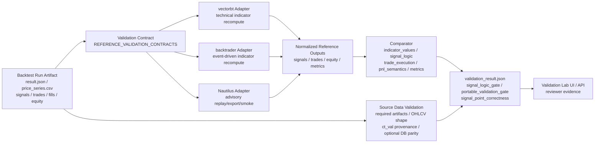
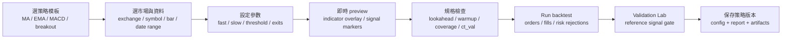

# Validation Lab 報告草稿

本文件整理目前專案內 Validation Lab 的協作規範、驗證架構、外部回測引擎分工、參數判讀、限制，以及 2026-06-22 針對 `BTC-USDT-SWAP` / Binance / `1H` 的 MA、EMA、MACD signal-to-order 實測結果。

重要界線：本文件不宣稱任何策略已可 live trading。依 `docs/ai_collaboration.md`，live/demo/shadow 仍需要通過 source provenance、ct_val、idealized-fill 排除、differential validation、WF/CPCV、replay/shadow/demo 與使用者明確批准等 gate。

## 1. Validation Lab 的目的

你的理解大方向正確，但建議報告時這樣修正：

- Validation Lab 的目的不是單純替代 TradingView，而是用低成本、可版本化、可審計的方式，把本專案回測 artifact 丟給外部 reference engine 做交叉驗證。
- 目前主要驗證目標是 signal-point correctness：同一批價格資料、同一組策略參數、同一套 entry/exit 規則下，外部引擎是否在同一根 K、同一商品、同一方向產生同一個 action。
- vectorbt / backtrader 對 MA、EMA、MACD 技術策略是 `reference_signals_only`，可以作 signal-logic strict gate。
- Nautilus 目前是 advisory replay/export/smoke，不是完整 matching engine parity。它可以增加信心，但不能單獨讓 portable validation gate 通過。

## 2. 驗證架構流程圖

低成本的意思是：不依賴付費閉源回測平台產生最終信任，而是把本專案已保存的 artifact 用開源或本地 reference path 重算、比對、留存 JSON/CSV 證據。這也比較符合專案協作要求：不要靠聊天記憶或主觀判斷，要靠 repo 內可讀、可重跑的檔案。

## 3. 資料正確性目前如何驗證

目前已實作的資料驗證：

- `price_series.csv` 結構檢查：時間、OHLCV、商品欄位是否可讀。
- required artifacts 檢查：不同策略需要的價格、signals、funding、external observations 等檔案是否存在。
- `ct_val` provenance 檢查：SWAP 合約乘數來源是否 authoritative，例如 DB 或明確 config override；非權威來源不得當作部署證據。
- optional DB parity：設定 `DIFF_VALIDATION_ENABLE_DB_PARITY=1` 並提供 DSN 時，會把 artifact close prices 與 canonical DB candles 做 timestamped close-only 比對。
- source provenance gate：現有 durable Binance DB-backed PASS 證據在 `results/adr0007_binance_btc_1h_db_pass_20260618/validation/codex_close_only_db_parity_pass_20260618/validation_result.json`。

目前尚未完整實作的資料驗證：

- 尚未做 Binance vs OKX vs Bybit 等跨交易所永續合約 K 線的相對性驗證。
- 尚未證明交易所 API 原始資料本身一定正確；目前 DB parity 只證明「回測 artifact 與本專案 canonical DB close price 一致」。
- 尚未對高低價、成交量、funding、trade ticks、order book 做完整跨來源一致性驗證。

所以你的說法「資料主要來源是交易所 API，因此只能透過其他交易所 API 永續合約數據驗證相對性」方向正確，但要補一句：目前專案已先做 artifact-to-DB provenance / parity；跨交易所相對性驗證仍是後續工作，不是已完成能力。

## 4. 本專案與三個外部回測軟體的輸入資料比較

| 項目 | 本專案 replay backtest | vectorbt | backtrader | Nautilus 目前 v1 |
| --- | --- | --- | --- | --- |
| 主要輸入 | `config`, `price_series.csv`, `book_snapshots.csv`, strategy params, risk config, instrument specs | `price_series.csv` close series, strategy params, `signals.csv` 比對 | OHLCV Pandas feed, strategy params, project-compatible indicator state | Artifact signals/prices 轉成 Nautilus-compatible replay/export/smoke |
| 商品與合約規格 | 需要 `ct_val`, `minSz`, `lotSz`, exchange/instrument specs | Signal gate 不需要完整合約規格；PnL advisory | Signal gate 不需要完整合約規格；market-order PnL advisory | 完整 parity 需要 Nautilus catalog/instrument mapping；目前未完成 |
| 風控與下單 | 會經過 sizing、`max_order_notional_usd`、position limit、kill/drawdown、execution model | 嚴格比 signal；`Portfolio.from_signals` equity advisory | 嚴格比 signal；broker/market-order advisory | Advisory order/fill replay/smoke；非專案策略原始碼 parity |
| 資料頻率 | 支援 replay bar / tick / book artifacts，依策略而定 | technical v1 主要用 close / OHLCV | OHLCV feed 逐 bar | 目前可轉 tick/signal smoke；完整 L2/L3 仍待實作 |
| 嚴格比較範圍 | 專案自身產生完整 orders/fills/equity | indicator/signal timing/side/action | indicator/signal timing/side/action | signal replay point correctness/advisory |
| Advisory 範圍 | 回測績效仍需 WF/CPCV 與 replay gates | trade/PnL/equity/metrics | trade/PnL/equity/metrics | execution/PnL/funding/queue/full matching |

相同點：

- 都使用同一個 artifact bundle 或由該 bundle 派生的資料。
- 都會把輸出標準化成 signals、trades、equity、metrics 供比較。
- MA/EMA/MACD 技術策略都以同一組 fast/slow/default MACD 參數重算 crossover。

不同點：

- 本專案會真的經過 portfolio sizing、risk guard、order manager、execution handler，因此可以看到訊號是否變成 order、fill、rejection。
- 外部引擎 v1 主要是 reference signal recompute；它們不是目前專案風控/撮合模型的完整替身。
- Nautilus 是未來高保真 execution parity 的目標，但目前不是完整 Nautilus matching engine 驗證。

## 5. 如何確保策略在不同回測系統結果一致

目前一致性的定義是分層的：

1. Strict signal logic：外部 reference engine 重新計算 indicator 與 crossover，不直接信任本專案 signals。若 timestamp、symbol、side、action 對齊，且 actionable mismatch count 為 0，則 signal logic 通過。
2. Advisory execution/PnL：外部引擎可產生 trades、equity、metrics，但因 order semantics、fee、partial fill、queue、funding 與 ct_val PnL 可能不同，v1 不把這些當 hard gate。
3. Portable validation gate：對技術策略，至少一個 vectorbt 或 backtrader 的 `signal_logic.status == PASS` 且 `actionable_mismatch_count == 0`，才可算 signal-portability 通過。
4. Source data validation：即使 signal 通過，若 `ct_val` provenance 或 DB parity/source gate 不通過，也不能當 promotion evidence。

既有 fixture evidence 顯示 MA、EMA、MACD 在 2026-06-16 批次三引擎 signal-point validation 中通過：

| 策略 | status | portable gate | source data | vectorbt signal_logic | backtrader signal_logic | Nautilus |
| --- | --- | --- | --- | --- | --- | --- |
| `ma_crossover` | PASS | true | PASS | PASS / 0 actionable mismatch | PASS / 0 actionable mismatch | PASS advisory |
| `ema_crossover` | PASS | true | PASS | PASS / 0 actionable mismatch | PASS / 0 actionable mismatch | PASS advisory |
| `macd_crossover` | PASS | true | PASS | PASS / 0 actionable mismatch | PASS / 0 actionable mismatch | PASS advisory |

證據位置：

- `results/strategy_validation/ma_crossover/codex_20260616_signal_validation_three_engine_signal_point/validation_result.json`
- `results/strategy_validation/ema_crossover/codex_20260616_signal_validation_three_engine_signal_point/validation_result.json`
- `results/strategy_validation/macd_crossover/codex_20260616_signal_validation_three_engine_signal_point/validation_result.json`

注意：這是 fixture / signal validation evidence，不等於本次 BTC/Binance 長區間 run 已完成三引擎 validation。

## 6. Validation result 主要參數怎麼看

| 欄位 | 怎麼看 |
| --- | --- |
| `status` | 整體 validation run 狀態。PASS 不等於 live-ready，只代表該 artifact 的 validation scopes 沒有 hard failure。 |
| `admissibility` | 通常為 `advisory_only`；表示不能單獨當 live/promotion 證據。 |
| `promotion_gate_evidence` | 是否可直接當 promotion gate 證據。目前多數仍為 false。 |
| `source_data_validation.status` | 資料與 provenance gate。PASS 才表示 artifact 結構、必要檔案與 ct_val 等檢查符合該 run scope。 |
| `source_data_validation.checks.db_parity.status` | DB parity 是否執行。SKIP 代表未設定 DB parity，不代表失敗，但 source-provenance gate 若要求 DB-backed evidence 時會阻擋。 |
| `source_data_validation.checks.ct_val_provenance.status` | SWAP 合約乘數來源是否權威。這會影響 PnL / notional / risk 判讀。 |
| `signal_logic_gate.passed` | 技術策略最重要的 hard gate：至少一個 vectorbt/backtrader signal logic PASS 且 actionable mismatch 為 0。 |
| `portable_validation_gate.passed` | 該策略是否有合格 portable reference path。Advisory replay 不能讓它通過。 |
| `signal_point_correctness.passed` | 三引擎 point correctness matrix 的摘要。要看每個 engine role，Nautilus v1 是 advisory。 |
| `engines.<engine>.reference_role` | `reference_signals_only` 表示獨立重算 signal；`advisory` 表示只可作補充。 |
| `engines.<engine>.comparison.signal_logic.status` | signal timing/side/action 的嚴格比較結果。 |
| `actionable_mismatch_count` | 需要修正或審查的 mismatch 數。signal logic 中非 0 會阻擋。 |
| `downstream_mismatch_count` | 常由前段 signal 差異導致的衍生 mismatch；不一定代表獨立 bug。 |
| `mismatch_counts` / `mismatches_*.csv` | 可追到 indicator、signals、trades、PnL、metrics 的具體差異列。 |
| `nautilus_order_fill_parity` | Nautilus advisory replay/smoke 狀態，不是完整 matching engine parity。 |
| `validation_conclusion` | 對 gate 結論與 blocked reasons 的文字化摘要。 |

回測 result 內常見績效/執行欄位：

- `n_periods` / `gate3_data_coverage.coverage_pct`：資料期數與 coverage。Coverage 高只代表資料完整，不代表資料真實性已跨來源驗證。
- `total_return`, `sharpe`, `max_drawdown`：績效摘要；必須搭配 WF/CPCV、DSR/PSR、out-of-sample 判讀。
- `submitted_order_count`, `real_fill_count`, `fill_rate`：訊號是否真的進到 orders/fills。
- `rejected_count`, `risk_summary.by_reason`：風控阻擋原因，例如 `fat_finger`。
- `ct_val_sources`, `ct_val_all_authoritative`：SWAP notional / contract size 是否可被信任。

## 7. 驗證結果的限制與「通過」代表什麼

如果 Validation Lab 通過，最多代表：

- 在相同 artifact、相同參數、相同策略規則下，外部 reference engine 與本專案對 signal timing / side / action 有交叉一致性。
- artifact 基本結構與必要 source/provenance checks 在該 run scope 下沒有 hard failure。
- reviewer 可以用產出的 JSON/CSV 追溯每個引擎與 mismatch。

它不代表：

- 策略可 live trading。
- PnL、Sharpe、drawdown 已被外部引擎嚴格驗證。
- fees、slippage、funding、partial fill、queue priority、L2/L3 order book、exchange adapter 行為完全一致。
- 交易所 API 原始資料絕對正確。
- 參數沒有 overfitting；仍需 WF/CPCV、out-of-sample、shadow/demo evidence。
- Nautilus 已跑完整 matching engine；目前 v1 還不是 full parity。

## 8. 最大下單額度與外部引擎差異

目前本專案風控預設：

- `max_order_notional_usd = 500`
- `max_pos_pct_equity = 0.30`
- `max_leverage = 3.0`

專案下單流程：

1. 策略產生 `SIGNAL`。
2. Portfolio manager 根據 equity、vol target/fixed fraction、instrument specs 估算數量。
3. 先把 entry/open size cap 到 `max_order_notional_usd` 附近。
4. RiskGuard 再檢查 fat-finger / position limit / kill / drawdown 等。
5. 通過後才送 `ORDER`，接著由 replay execution 產生 fills。

重要差異：

- vectorbt/backtrader 的 strict gate 目前只驗 signal，不會完整套用本專案的 `max_order_notional_usd` 與 reduce-only/fat-finger 行為。
- Nautilus v1 也不是用本專案風控原始碼跑完整 parity。
- 因此不能用外部引擎的 order count / PnL 直接和本專案結果硬比。
- 2026-06-22 後的專案規則：`reduce_only` close order 可在不超過目前持倉 notional 的範圍內繞過單筆 fat-finger cap；entry/open order 仍受 `max_order_notional_usd` 限制。

建議比較方式：

1. 第一層：比較 signal-only。確認 entry/exit 發生在哪些 bar、side/action 是否一致。
2. 第二層：比較本專案 execution realization。列出每個 signal 變成 submitted order、fill 或 rejection 的比例。
3. 第三層：若要比較 order/PnL，必須把相同 sizing/risk/fill model 移植到 reference adapter，或將它明確標示為 advisory。

## 9. 2026-06-22 BTC/Binance 1H 實測

測試條件：

- Symbol: `BTC-USDT-SWAP`
- Exchange: Binance
- Bar: `1H`
- Local data: `data/ticks/BTC_USDT_SWAP/candles_1H.parquet`
- Window: 2024-01-01 to 2026-04-30
- Coverage: 20,400 expected / 20,400 actual bars, `coverage_pct = 1.0`
- MA: fast/slow = 10/200
- EMA: fast/slow = 10/200
- MACD: default 12/26/9
- Risk defaults: max order notional 500 USD, max position pct equity 30%, max leverage 3
- Output summary: `results/validation_lab_signal_order_check_20260622.json`

結果摘要：

| 策略 | 參數 | verdict | signals | submitted orders | real fills | rejected | 主要 rejection |
| --- | --- | --- | ---: | ---: | ---: | ---: | --- |
| `ma_crossover` | 10/200 SMA | PASS_SIGNAL_TO_ORDER | 117 | 5 | 31 | 112 | `fat_finger` |
| `ema_crossover` | 10/200 EMA | PASS_SIGNAL_TO_ORDER | 127 | 4 | 22 | 123 | `fat_finger` |
| `macd_crossover` | 12/26/9 | PASS_SIGNAL_TO_ORDER | 779 | 779 | 15 | 0 | none |

本次可確認：

- MA、EMA、MACD 都能在 signal 觸發時進入下單路徑，至少有 submitted order 與 real fill。
- `ct_val_sources.BTC-USDT-SWAP` 為 DB source，value 1.0，exchange binance；`ct_val_all_authoritative = true`。
- 修改前觀察：MA/EMA 的大量後續出場被 `fat_finger` 擋下，原因是持倉 notional 隨 BTC 價格上升後超過 500 USD 單筆上限。這不是 signal 失效，而是當時 reduce/exit notional 仍套用 entry fat-finger cap 的互動結果。2026-06-22 後已改成 bounded reduce-only bypass。
- MACD 因 signal 頻率高且每次 notional 接近 500 USD，全部 779 個 signals 都進到 submitted orders，但 replay fill 只有 15 rows，顯示在目前 replay L1 resting execution model 下，submitted order 不等於一定成交。

2026-06-22 風控修正後，以 `max_order_notional_usd=250`、`max_pos_pct_equity=1.0` 重跑：

| 策略 | signals | submitted orders | real fills | rejected | risk bypass |
| --- | ---: | ---: | ---: | ---: | --- |
| `ma_crossover` | 117 | 117 | 30 | 0 | `allowed_reduce_only_bypass:fat_finger_reduce_only` 1 次 |
| `ema_crossover` | 126 | 126 | 10 | 0 | none |
| `macd_crossover` | 779 | 779 | 13 | 0 | none |

這表示 MA 的「出場單被 entry fat-finger cap 擋住」問題已解除；剩下的成交偏少主要是 replay fill model / maker-only resting order 的問題。

本次未完成：

- 嘗試對上述三個長區間 run 直接跑 `scripts/run_differential_validation.py --engines vectorbt,backtrader,nautilus`，超過兩分鐘未落地 validation artifact，已停止。
- 也嘗試 MACD + vectorbt 單引擎，包含 `NUMBA_DISABLE_JIT=1` 後仍未在 60 秒內落地 artifact，已停止。
- 專案 `docs/RUNBOOK.md` 已記載 Windows/vectorbt/Numba 可能卡住；正式 CI/fixture runner 使用較小 fixture 與 `NUMBA_DISABLE_JIT=1`。

建議後續驗證：

- 針對 BTC/Binance 10/200 與 MACD 建立短區間 fixture bundle，例如 300-800 bars，保留至少一組 entry/exit，先跑完三引擎 validation。
- 或優化底層 differential validation CLI，使長區間 technical reference 可串流/抽樣/先落地進度。
- 若要把本次實測提升到 promotion-grade evidence，需要 DB parity、source provenance、vectorbt/backtrader signal quorum、WF/CPCV、replay/shadow/demo 全部完成。

## 10. 新手不透過 GenAI 發想與套用策略的實作計畫

建議採取最保守且安全的路線：先做 no-code strategy template builder，不讓新手直接寫任意 Python。

### 設計原則

- 不允許使用聊天記憶或自然語言直接改策略假設；策略規格必須落成可版本化 config/spec。
- 先支援低風險 technical template，例如 MA、EMA、MACD、RSI/breakout 類型；再擴到 funding/pairs/rotation。
- 每個 template 都要宣告可驗證輸入、參數範圍、lookahead guard、reference validation contract。
- Builder 的輸出是 strategy spec + backtest config，不是任意程式碼。

### 使用者流程

### 實作階段

| Phase | 目標 | 主要工作 | 驗收 |
| --- | --- | --- | --- |
| 0 | 定義策略 spec schema | 新增 template schema、參數型別、範圍、預設值、禁用條件 | docs/spec 與 unit tests |
| 1 | Technical builder UI | 在前端提供 template picker、symbol/bar/date、參數控制、indicator preview | 新手可建立 MA/EMA/MACD config |
| 2 | Backend validation | API 驗證 spec，不允許非法參數、lookahead 或缺資料 | invalid spec 被拒絕 |
| 3 | Backtest integration | spec 轉成既有 `strategies.yaml` / run request，不新增交易邏輯 | 能產生 artifact |
| 4 | Validation Lab integration | 產生後自動提示跑 signal validation，呈現 gate 結果 | validation_result 可從 UI 查看 |
| 5 | 擴充模板 | 加 RSI/breakout/funding/pairs 類別 | 每類都有 reference contract 或明確 blocked gap |

可能涉及檔案：

- Frontend: `frontend/view-config.js`, `frontend/data.js`, 可能新增 `frontend/view-strategy-builder.js`
- API: `src/okx_quant/api/routes_backtest.py`
- Strategy config/schema: `config/strategies.yaml` 相關 schema
- Validation: `backtesting/differential_validation.py::REFERENCE_VALIDATION_CONTRACTS`
- Docs: `docs/FEATURE_MAP.md`, `docs/UI_MAP.md`, `docs/DATA_FLOW.md`, `docs/RUNBOOK.md`

不建議第一版做的事：

- 不做任意 Python strategy upload。
- 不讓新手一鍵 live/demo。
- 不把 GenAI 產生的文字直接寫入策略假設。
- 不讓沒有 reference contract 的策略進入 promotion path。

## 11. 剩餘計畫與未完成項

短期：

- 把本次 `scripts/run_validation_lab_signal_order_check.py` 納入可重跑的報告輔助命令或轉成正式 smoke test。
- 針對長區間 differential validation 卡住問題做 systematic debugging：先量測載入 artifact、vectorbt import、reference signal recompute、compare/write CSV 各段耗時。
- 建立短區間 BTC/Binance fixture，使 MA/EMA 10/200 與 MACD 12/26/9 都能跑完三引擎 validation。

中期：

- 實作跨交易所資料相對性檢查：同 timeframe 下比對 Binance/OKX/Bybit close return correlation、gap、outlier、funding 時間軸。
- 把 max order notional / reduce-only / fat-finger 行為納入可視化 signal-to-order report。
- 將 beginner strategy builder 與 Validation Lab 串接。

長期：

- 完成 Nautilus catalog / instrument / order / fill / funding mapping，讓 Nautilus 能成為 execution-sensitive reference，而非 advisory。
- 將 shadow/demo 回寫的 latency、queue fill、partial fill 參數納入 replay calibration。
- 建立 promotion package：source provenance + signal quorum + WF/CPCV + replay/shadow/demo + Claude review + human approval。

## 12. 報告時建議講法

一句話版本：

> Validation Lab 不是要證明策略一定賺錢，而是用低成本外部 reference engine 驗證「同資料、同參數、同規則下，訊號點是否一致」。目前 MA/EMA/MACD 的 fixture signal validation 已通過 vectorbt/backtrader/Nautilus point checks；但真實長區間 BTC/Binance run 的三引擎 differential validation 本次尚未完成，所以不能把它說成 live-ready 或 promotion-ready。實測顯示三個策略都能從 signal 走到 order/fill；修改前 MA/EMA 的大量 rejection 來自 500 USD fat-finger cap 與 reduce-only close 的互動，這是風控與 execution realization 的問題，不是外部 signal gate 的比較範圍。
